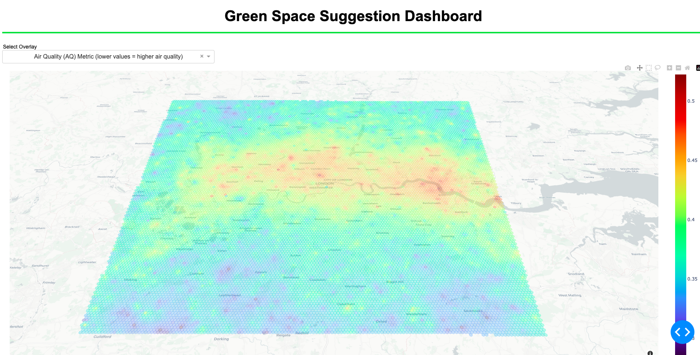

# ASDI-Hackathon: Greenspace Suggestion Dashboard

## Overview
'Today, 56% of the world's population - 4.4 billion inhabitants - live in cities. This trend is expected to continue. By 2050, with the urban population more than doubling its current size, nearly 7 of 10 people in the world will live in cities.'

The World Bank
https://www.worldbank.org/en/topic/urbandevelopment/overview#:~:text=Today%2C%20some%2056%25%20of%20the,world%20will%20live%20in%20cities

Green spaces improve both the environmental and social conditions of cities. Air quality, population satisfaction, urban temperatures, biodiversity, flood risk reduction, noise abatement - these are among the major benefits of greenspaces on an urban area. Multiple datasets available through the Amazon Sustainability Data Initiative can be leveraged to inform locations for green spaces that would maximise their positive effects on these urban conditions. We have extracted the raw data from their associated S3 buckets, processed them by way of upsampling them to allow for a high enough resolution that would make the dashboard useable by city planners. The resolution itself is a parameter, with the distance weighted k-nearest neighbours (KNN) models able to handle a higher resolution should said city planner wish it - a Sagemaker processing job enables this to be automated and scaled. The final dashboard aggregates the underlying data into a green space score that summarises where potential greenspaces would most benefit the aforementioned urban conditions. The below image illustrates the dashboard green space score. Our chosen demo city was London.

The calculation of the score has been left open-ended due to the inevitable intricacies of underlying mechanisms between the data and the limitations of the data - is one dataset more worthwhile to green space suggestion than another? The air quality dataset, for example, was the 4th attempt at extracting useable data of the like. SILAM was explored but it relied on physical sensors which were too few in number to provide the resolution we wanted, accurately. The Safecast dataset again used physical sensors. OpenAQ was also explored, but besides some data quality issues in the S3 bucket data, it again had too few physical sensors that could be upsampled to a high enough resolution. Sentinel-5P was satellite data which promised to provide a higher resolution from the get go given there was no reliance on physical sensors, however the coverage of London (our chosen demo city) was sporadic. Besides having to figure out which of the NetCDF files included coverage of London, the main issue was that the data was presented as the total vertical column of e.g. Nitrogen Dioxide. In other words, the number of molecules from a 2D planar view of the Earth in the atmosphere. While an inaccurate representation of near-surface Nitrogen Dioxide levels, it provides a somewhat useable approximation. It was unfortunate that standard Air Quality indices such as those produced by the Environmental Protection Agency (EPA) could then not be used to properly contextualise the values. Our Air Quality Score itself therefore was naive in its formulation. With further time, atmospheric models could be used to approximate near-surface levels better. That being said, visually, the results are useable - the below image of the dashboard air quality score clearly reflect worse air quality around the centre of London.

A cornerstone of our project was the weighted distance K-Nearest Neighbour models employed to upsample the datasets to our resolution. These models considered n number of neighbours and then aggregated their values while weighting how far away they are from the map coordinate value to be predicted. Our inputs were longitudes and latitudes so working out the distance required preprocessing to consider the speherical nature of the Earth that these coordinates reflect. We explored two methods for converting these distances into something useable by the KNN models, we wanted to collapse a 3D space into a 2D one that the models would understand. The Vincenty and Haversine formulae work in similar ways but consider different levels of nuance as far as the shape of the Earth is concerned. The Earth is not a perfect sphere, it is elliptical, with the equator being a little fatter than would otherwise be in a sphere. Vincenty considers the Earth's elliptical nature, while the Haversine is a little more naive in this way. At the resolution we were using, and at the scale of a single city, the benefits of using Vincenty over Haversine was marginal. It just so happened that SKLearn facilitated Haversine, so we chose to go with that.

Using API calls from the Ordinance Survey API, we were able to return a boolean value for whether a certain land type exists at a certain latitude and longitude. The idea here was that, given the land type, a greenspace maybe more or less suitable. For example, if there existed a natural water body on a coordinate, this should be reflected in the green space score overlay; and it was. 

Another land type we considered was current green spaces. We were able to derive another overlay from this, the average distance from the nearest 3 green spaces. Informing whether a green space is nearby a specific coordinate is paramount to deciding whether a green space is in fact needed because it provides the current green space context so to speak.

With regards to population density and its relation to population wellbeing for urban metropolises, we integrated World Health Organisation satndards for ideal green space availability per capita. This set a benchmark from which to attribute a component to the score of the green space score. WHO standards cite 50m2 per capita as being ideal for a city metropolis (https://www.ncbi.nlm.nih.gov/pmc/articles/PMC6209905/#:~:text=The%20World%20Health%20Organization%20%5B36,50%20m2%20per%20capita.). Should the city in question fail to reach this standard, the weighting of the population component in the green space score dynamically rises to reflect the increased necessity to improve that aspect of urban conditions.

## UN Sustainable Development Goal
We meet the following UN Sustainable Development Goals:
- Good health and Well-Being
    - Green spaces protect the local populace from toxic gases, high urban temperatures but also provide a mental benefit by being a place of community and activity
- Reduced inequalities
    - Considering the wide ranging benefits of greenspaces to people's health and well-being, our dashboard should help solve 'greenspace inequality'
- Sustainable Cities and Communities
    - 
- Climate Action
    - Green spaces contribute to the absorption of greenhouse gases and reduced surface temperatures
- Life on Land
    - Green spaces in urban metropolises' protect the biodiversity by allowing space for ecosystems to thrive
- Partnerships for the Goals
    - Given the wide-ranging data employed and the need for specialists to hone in the calculation of a green space score, no doubt our dashboard and its maintenance requires a coalition of parties to ensure it succeeds

## Future Work
Besides obviously expanding the datasets and getting true domain experts to refine the greenspace calculation, we see an expansion of scope of this project to envelope other major cities of the world. Once this is achieved, further aggregated analysis can be provided on the dashboard such as relative metrics to compare cities. 

We have also explored developing a data pipeline to facilitate new data through processing jobs on Sagemaker; this cloud infrastructuture would be integral to any expansion going forward, particularly given the option for scaleability as the data becomes larger and larger - it also permits automation. 

Our resolution of 250m is a parameter, the KNN weighted distance models facilitate any resolution, however, of course, ideally, one would prefer to add higher resolution data to begin with so that its predictions do not deviate too much from reality. We also would have liked to expand the land types to include other key infrastructure that a greenspace should not be suggested to replace such as hospitals.

We have demonstrated our dashboard via Plotly Dash, which suited our needs for a Minimum Viable Product, however there are major drawbacks with regards to the performance of plotting at this resolution; in fact we became limited to 250m given Plotly Dash started to crash with anything beyond. Given more time, we would implement our dashboard in AWS QuickSight given their affinity with larger datasets, not to mention the easy integration available with other cloud infrastructure.

## How to setup and run
The project is fully functional with the local CSVs as well as access to the S3 bucket wherein the CSVs are also stored. Within the Notebooks folder, simply run create_penultimate.ipynb (with the chosen cells) followed by create_final_df.ipynb. These populate the final CSV (final_df.csv) that is plotted via the Plotly Dash App.

To initialise the Plotly Dash web app, run app.py in the Plotly_Dash_App folder. This step can be run with the currently populated local final CSV, final_df.csv. To run on the ocmmand line, cd into Plotly_Dash_App folder and run 'python3 app.py'.

Talk about setting up s3 bucket calls including processing.py

Formulae?

